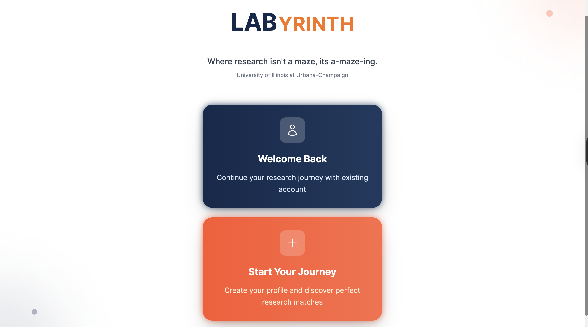

# LABYRINTH 
### A Research Matching Platform

*Connecting ambitious students with research opportunities through smart matching algorithms*




##  Problem Statement

Research discovery is broken. Students face:
- **Fragmented platforms**: Handshake, LinkedIn, REU boards, Canvas, email threads, bulletin boards
- **Information overload**: Difficult to stay informed about relevant opportunities
- **Cold outreach**: Inefficient email-based application processes

Professors struggle with:
- **Manual screening**: Sifting through unqualified applications
- **Email clutter**: Managing research inquiries alongside teaching commitments
- **Time constraints**: Limited bandwidth for mentorship matching

##  Solution

LABYRINTH reimagines undergraduate research discovery through an intelligent, centralized matching platform that connects students and professors based on research interests, skills, availability, and academic compatibility.

### Key Features
- **Smart Matching Algorithm**: Multi-factor compatibility scoring
- **Centralized Discovery**: Single platform for all research opportunities
- **Mutual Interest System**: Students can express interest; professors see qualified candidates
- **Academic Integration**: GPA considerations and academic level compatibility
- **Availability Matching**: Time commitment and mentorship style alignment

## Demo
[](https://youtu.be/FDzp6GrEe70)

##  Quick Start

### Installation

```bash
# Clone the repository
git clone https://github.com/your-username/labyrinth.git
cd labyrinth

# Install dependencies
npm i

# Run the development server
npm run dev
```

Visit `http://localhost:3000` to see the application.

##  Tech Stack

- **Frontend**: React, Next.js, TypeScript
- **Styling**: Tailwind CSS
- **State Management**: React Hooks, Local Storage
- **Deployment**: Vercel (recommended)
- **Data Storage**: Local Storage (development), ready for database integration

##  Matching Algorithm

LABYRINTH uses an enhanced matching algorithm that calculates compatibility scores based on five key factors:

### Scoring Weights
```typescript
const weights = {
  researchAlignment: 0.35,    // Research interest overlap
  skillsMatch: 0.25,          // Technical skills compatibility  
  academicLevel: 0.15,        // Student year vs professor preference
  gpaConsideration: 0.10,     // GPA expectations by professor rank
  availabilityFit: 0.15       // Time commitment alignment
};
```

### 1. Research Interest Alignment (35%)
- **Semantic similarity matching** using enhanced keyword analysis
- **Synonym recognition** for related fields (e.g., "AI" ↔ "Machine Learning")
- **Domain expertise mapping** across academic disciplines

### 2. Skills Match (25%)
- Required skills vs student capabilities
- Technical competency validation
- Programming languages, tools, and methodologies

### 3. Academic Level Compatibility (15%)
- Student year (Freshman → PhD) vs professor preferences
- **Compatibility scoring** with distance-based penalties
- Hierarchical academic progression consideration

### 4. GPA Considerations (10%)
- **Professor rank-based expectations**:
  - Professor: 3.5+ GPA expectation
  - Associate Professor: 3.4+ GPA expectation  
  - Assistant Professor: 3.2+ GPA expectation
  - Lecturer: 3.0+ GPA expectation

### 5. Availability Fit (15%)
- **Time commitment matching**:
  - Part-time (10-15 hrs/week) → 12.5 hrs
  - Part-time (15-20 hrs/week) → 17.5 hrs  
  - Full-time options → 40 hrs
- **Mentorship style compatibility**:
  - Hands-on/Intensive: 20+ hrs required
  - Collaborative: 15 hrs required
  - Independent: 10 hrs required

### Priority Boosting System
- **Student Interest Boost**: +8 points when students mark interest
- **Professor Priority Boost**: +15 points for interested students (professor view)
- **Minimum Threshold**: 25% score required for match consideration


**Similarity Scoring**:
- Exact match: 100%
- Substring match: 90%
- Common words: 70-90%
- Synonym recognition: 80%

##  Project Structure

```
labyrinth/
├── components/           # React components
│   ├── ui/              # Reusable UI components
│   ├── forms/           # Form components
│   └── matching/        # Matching-related components
├── pages/               # Next.js pages
├── types/               # TypeScript type definitions
├── utils/               # Utility functions
│   └── matching.ts      # Core matching algorithm
├── styles/              # Global styles
└── public/              # Static assets
```

##  Core Features

### For Students
- **Profile Creation**: Research interests, skills, GPA, availability
- **Smart Discovery**: AI-powered research opportunity recommendations
- **Interest Tracking**: Mark interest in professors/projects
- **Match Analytics**: Compatibility scores and common interests

### For Professors  
- **Project Posting**: Research areas, requirements, mentorship style
- **Student Discovery**: Browse qualified, interested candidates
- **Priority Matching**: Interested students highlighted first
- **Efficient Screening**: Pre-filtered candidate pool

### For Universities
- **Centralized Platform**: Single source for undergraduate research
- **Analytics Dashboard**: Matching success metrics
- **Institutional Integration**: Ready for campus-wide deployment
- **Scalable Architecture**: Multi-university support ready

##  Matching Analytics

The platform provides comprehensive matching insights:

```typescript
export const getMatchingAnalytics = () => ({
  totalStudents: number,
  totalProfessors: number, 
  totalInterests: number,
  activeMatches: number,
  contactedMatches: number
});
```

##  Roadmap

### Phase 1: Core Platform 
- [x] Student/Professor profiles
- [x] Matching algorithm implementation
- [x] Interest tracking system
- [x] Basic analytics

### Phase 2: Enhanced Features 
- [ ] Real-time messaging system
- [ ] Application workflow management
- [ ] Advanced analytics dashboard
- [ ] Email notification system

### Phase 3: Scale & Integration (Ongoing)
- [ ] Database integration (PostgreSQL/MongoDB)
- [ ] University SSO integration
- [ ] Multi-institution support
- [ ] Mobile application

### Phase 4: AI Enhancement (Future Scope)
- [ ] Machine learning recommendation engine
- [ ] Natural language processing for research descriptions
- [ ] Predictive matching success scoring
- [ ] Automated opportunity suggestions

##  Institutional Partnership

LABYRINTH is designed for university-wide adoption:

- **Standardized Process**: Consistent research application workflow
- **Administrative Efficiency**: Reduced email overhead for faculty
- **Student Success**: Improved research participation rates
- **Institutional Analytics**: Research program insights

**Funding Model**: Institutional partnerships, educational grants, SaaS licensing

---


*LABYRINTH - Navigate your research journey*
